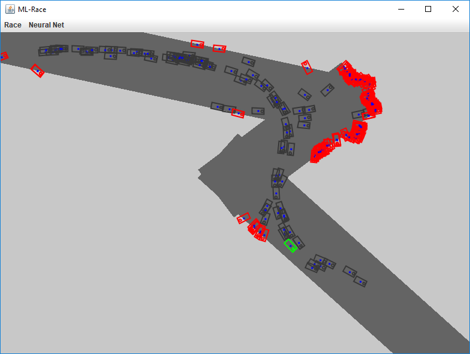

# Machine Learning Race

### Build Status

| master | develop |
|--------|---------|
|  |  |
|  |  |

### General Idea
This project uses a genetic machine learning algorithm to control some
little _cars_. The project is a work in progress and just started, so
a lot of features are not working yet.

The screenshot below shows the current state. There are some automatic
driving _cars_, which can measure distances to their
surroundings. The distances will be used as inputs for a neural network.
Basically, the neural network should return two outputs, one for
acceleration/deceleration and the other one for turning the car...
hopefully. :P

### How to run the project
This project uses [Maven](http://maven.apache.org/) as a build-tool, so
make sure to download it and set it up on your machine.
* Build the project with `mvn clean package`
* Run in with `mvn exec:java`

### New Ideas / Remaining Tasks

* ~~simple moving cars~~
* ~~race-track generator~~
* interactive features like:
    * show only best car, hide others
    * change (increase/decrease/toggle) mutation rate
    * add trace for each car, which visualizes the driven path
    * ~~save neural network of current best car~~
    * ~~load neural network~~
    * ~~use neural network of best car for all other cars~~
    * mouse events like zooming & panning 
    * drawing new racetracks via mouse movement
* better fitness function
* fancy looking cars (image)
* probably a lot of other stuff :D

